# 欢迎来到CB的Github 👋

  
  

    

## Picture of the day

  

>The  marabou stork  ( Leptoptilos crumenifer ) is a large species of  wading bird  in the stork family,  Ciconiidae . Breeding in sub-Saharan Africa, it eats mainly  carrion , scraps and  faeces , but will opportunistically eat almost any animal matter it can swallow. It occasionally eats other birds including  Quelea  nestlings,  pigeons and doves ,  pelican  and  cormorant  chicks, and even  flamingos . During the breeding season, adults scale back on carrion and take mostly small, live prey since nestlings need this kind of food to survive. Common prey at this time may consist of fish, frogs, insects, eggs, small mammals and reptiles such as crocodile hatchlings and eggs. Though known to eat putrid and seemingly inedible foods, these storks may sometimes wash food in water to remove soil. Increasingly, marabous have become dependent on human garbage and hundreds of the birds can be found around African dumps or waiting for a handout in urban areas. Those eating garbage have been seen to devour virtually anything that they can swallow, including shoes and pieces of metal, and those conditioned to eating from human sources have been known to lash out when refused food. This marabou stork was photographed in  Queen Elizabeth National Park  in southwestern Uganda.

  
  

   

